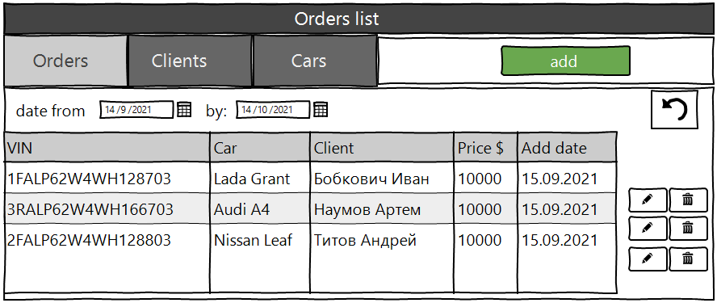
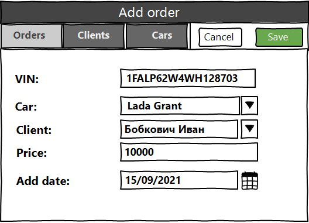
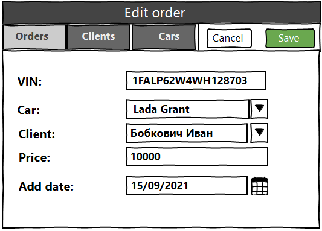
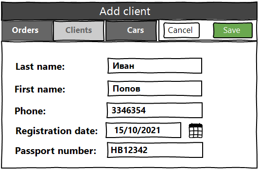
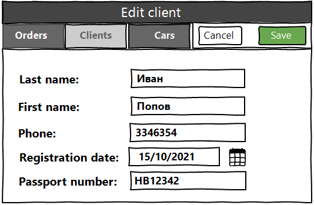
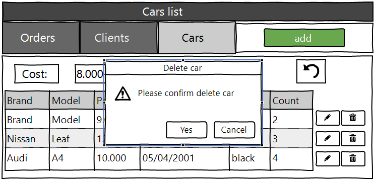

<h2 align="center">Accounting of cars in dealerships</h2>

<!--VISION-->
## Vision

"Car Registration in Dealerships" is a web application that allows the administrator to record information about cars.

Application should provide:

* Storing purchase orders, customers and cars in a database;;
* Display list of orders;
* Updating the list of orders (adding, editing, removing); ;
* Display list of clients;
* Updating the list of clients (adding, editing, removing);;
* Display list of cars;
* Updating the list of cars (adding, editing, removing);
* Display number of the orders for cars; ;
* Filtering by date orders;;
* Filtering by cost for cars.;
<!--/VISION-->

<!--ORDERS-->
## 1. Orders
### 1.1 Display list of orders

The mode is designed to view the list of orders, if it possible to display the number of orders for a specified period of time.

***Main scenario:***
* User selects item “Orders”;
* Application displays list of Orders.

 Pic. 1.1 View the Orders list.

The list displays the following columns:
* Car number – unique car number;
* Client  –  customer data;
* Price – the total price of the car;
* Add date – the date the order was added;

***Filtering by date:***

* In the order list view mode, the user sets a date filter and presses the refresh list button (to the right of the date entry field); 
* The application will display a form to view the list of orders with updated data. 
### 1.2 Add order

***Main scenario:***
* User clicks the “Add” button in the orders list view mode;
* Application displays form to enter order data;
* User enters order data and presses “Save” button;
* If any data is entered incorrectly, incorrect data messages are displayed;
* If entered data is valid, then record is adding to database;
* If error occurs, then error message is displaying;
* If new order record is successfully added, then list of orders with added records is displaying.

***Cancel operation scenario:***
* User clicks the “Add” button in the order list view mode;
* Application displays form to enter order data;
* User enters order data and presses “Cancel” button;
* Data don’t save in data base, then list of orders records is displaying to user;
* If the user selects the menu item "Orders”, ”Clients” or "Cars", the data will not be saved to the database and the corresponding form with updated data will be opened.

 Pic. 1.2 Add order.

***When adding a order, the following details are entered:***
* Client  – client’s first and last name;
* Car  – car description;
* Price – the total price of the car;
* Add date – date of adding order;

### 1.3 Edit order.

***Main scenario:***
* User clicks the “Edit” button in the orders list view mode; 
* Application displays form to enter order data; 
* User enters order data and presses “Save” button; 
* If any data is entered incorrectly, incorrect data messages are displayed; 
* If entered data is valid, then edited data is added to database; 
* If error occurs, then error message is displaying; 
* If order record is successfully edited, then list of orders with added records is displaying. 

***Cancel operation scenario:***
* User clicks the “Edit” button in the orders list view mode; 
* Application displays form to enter order data; 
* User enters order data and presses “Cancel” button; 
* Data don’t save in data base, then list of orders records is displaying to user. 
* If the user selects the menu item "Orders”, ”Clients” or "Cars", the data will not be saved to the database and the corresponding form with updated data will be opened.

 Pic. 1.3 Edit order.

***When editing a order, the following details are entered:***
* Client  – client’s first and last name;
* Car  – car description;
* Price – the total price of the car;
* Add date – date of adding order;

***Constraints for data validation:***
* Client  – maximum length of 90 characters; 
* Car  – maximum length of 90 characters;
* Price – maximum length of 90 characters;
* Add date – order add date in format dd/mm/yyyy.

### 1.4 Removing the order

***Main scenario:***
* The user, while in the list of orders, presses the "Delete" button in the selected order line;
* If the order can be removed, a confirmation dialog is displayed; 
* The user confirms the removal of the order; 
* Record is deleted from database; 
* If error occurs, then error message displays; 
* If order record is successfully deleted, then list of orders without deleted records is displaying.
 

 Pic. 1.4 Delete order dialog.

***Cancel operation scenario:****
* User is in display mode of orders list and press “Delete” button; 
* Application displays confirmation dialog “Please confirm delete order?”; 
* User press “Cancel” button; 
* List of orders without changes is displaying. 

## 2. Clients

### 2.1 Display list of Clients

This mode is intended for viewing and editing the clients list.

***Main scenario:***
* User selects item “Clients”; 
* Application displays list of clients.

 Pic 2.1 View the clients list.

The list displays the following columns:
* Last name – client’s last name; 
* First name – client’s first name; 
* Phone - the client's phone number;
* Registration date – client’s date registration; 
* Passport number – the unique number of the client's passport;

***Filtering by date:***
* In the clients list view mode, the user sets a date filter and presses the refresh list button (to the right of the date entry field); 
* The application will show the clients only for a certain period of time.

### 2.2 Add client

***Main scenario:***
* User clicks the “Add” button in the clients list view mode; 
* Application displays form to enter client data; 
* User enters client’s data and presses “Save” button; 
* If any data is entered incorrectly, incorrect data messages are displayed; 
* If entered data is valid, then record is adding to database;
* If error occurs, then error message is displaying; 
* If new client record is successfully added, then list of clients with added records is displaying.

***Cancel operation scenario:***
* User clicks the “Add” button in the clients list view mode; 
* Application displays form to enter client’s data; 
* User enters client’s data and presses “Cancel” button; 
* Data don’t save in data base, then list of clients records is displaying to user. 
* If the user selects the menu item "Orders”, ”Clients” or "Cars", the data will not be saved to the database and the corresponding form with updated data will be opened.

 Pic. 2.2 Add client.

When adding a client, the following details are entered:
* Last name – client’s last name; 
* First name – client’s first name; 
* Phone - the client's phone number;
* Registration date – client’s date registration; 
* Passport number – the unique number of the client's passport;

Constraints for data validation:
* Last name – maximum length of 45 characters; 
* First name –  maximum length of 45 characters; 
* Phone –  maximum length of 30 characters; 
* Registration date – client’s registration date in format dd/mm/yyyy
* Passport number - maximum length of 45 characters;

### 2.3 Edit client
***Main scenario:***
* User clicks the “Edit” button in the clients list view mode; 
* Application displays form to enter client data; 
* User enters client’s data and presses “Save” button; 
* If any data is entered incorrectly, incorrect data messages are displayed; 
* If entered data is valid, then edited data is added to database; 
* If error occurs, then error message is displaying; 
* If client’s record is successfully edited, then list of clients with added records is displaying. 

***Cancel operation scenario:***
* User clicks the “Edit” button in the clients list view mode; 
* Application displays form to enter client data; 
* User enters client data and presses “Cancel” button; 
* Data don’t save in data base, then list of clients records is displaying to user. 
* If the user selects the menu item "Orders”, ”Clients” or "Cars", the data will not be saved to the database and the corresponding form with updated data will be opened.

 Pic. 2.3 Edit client.
### 2.4 Removing client
***Main scenario:***
* The user, while in the list of clients mode, presses the "Delete" button in the selected client line; 
* Application displays confirmation dialog “Please confirm delete client?”; 
* The user confirms the removal of the client; 
* Record is deleted from database; 
* If error occurs, then error message displays; 
* If client record is successfully deleted, then list of clients without deleted records is displaying.

 Pic. 2.4 Delete client dialog.

***Cancel operation scenario:***
* User is in display mode of clients list and press “Delete” button; 
* Application displays confirmation dialog “Please confirm delete client?”;
* User press “Cancel” button; 
* List of clients without changes is displaying.

## 3.  Cars

### 3.1 Display list of cars
This mode is intended for viewing and editing the cars list
***Main scenario:***
* User selects item “Cars”; 
* Application displays list of cars.

 Pic. 3.1 View the cars list.

* Marka  –  marka car; 
* Model - car model;
* Cost - the cost of the car;
* Year of release - the year of the car 's release
* Color - the color of the car

***Filtering by cost:***
* In the car list view mode, the user sets the cost filter and clicks the refresh list button (to the right of the cost entry field );
* The application will display a form for viewing a list of cars with updated data.

### 3.2 Add car

***Main scenario:***
* User clicks the “Add” button in the cars list view mode; 
* Application displays form to enter car data; 
* User enters car data and presses “Save” button; 
* If any data is entered incorrectly, incorrect data messages are displayed; 
* If entered data is valid, then record is adding to database; 
* If error occurs, then error message is displaying; 
* If new car record is successfully added, then list of cars with added records is displaying.

***Cancel operation scenario:***
* User clicks the “Add” button in the cars list view mode; 
* Application displays form to enter car data; 
* User enters car data and presses “Cancel” button;
* Data don’t save in data base, then list of cars records is displaying to user. 
* If the user selects the menu item "Orders”, ”Clients” or "Cars", the data will not be saved to the database and the corresponding form with updated data will be opened.

 Pic. 3.2 Add car

When adding a car, the following details are entered:

* Marka - car marka;
* Model - car model;
* Cost - the cost of the car;
* Year of release - the year of the car 's release
* Color - the color of the car

Constraints for data validation:

* Marka - maximum length of 45 character;
* Model - maximum length of 45 character;
* Cost - maximum length of 45 character;
* Year of release - date of creation in the format dd/mm/yyyy.
* Color - maximum length of 45 character;

### 3.3 Edit car
***Main scenario:***
* User clicks the “Edit” button in the cars list view mode; 
* Application displays form to enter car data; 
* User enters car data and presses “Save” button; 
* If any data is entered incorrectly, incorrect data messages are displayed; 
* If entered data is valid, then edited data is added to database; 
* If error occurs, then error message is displaying; 
* If car record is successfully edited, then list of cars with added records is displaying. 

Cancel operation scenario:

* User clicks the “Edit” button in the cars list view mode; 
* Application displays form to enter car data; 
* User enters car data and presses “Cancel” button; 
* Data don’t save in data base, then list of cars records is displaying to user.

If the user selects the menu item "Orders”, ”Clients” or "Cars", the data will not be saved to the database and the corresponding form with updated data will be opened.

 Pic. 3.3 Edit car.

### 3.4 Removing the car

***Main scenario:***

* The user, being in the list of machines mode, presses the "Delete" button in the selected row of machines;
* The application displays a confirmation dialog box "Please confirm the removal of the machine ?”;”;
* The user confirms the removal of the machine;
* The record has been deleted from the database;
* When an error occurs, an error message is displayed;
* If the client record is successfully deleted, a list of machines without deleted records is displayed.

***Operation cancellation scenario:***
* The user is in the display mode of the list of machines and presses the "Delete" button.;
* The application displays a confirmation dialog box "Please confirm the removal of machines?”;
* The user clicks the "Cancel" button; 
* The list of machines is displayed unchanged.

 Pic. 3.4 Delete car dialog.